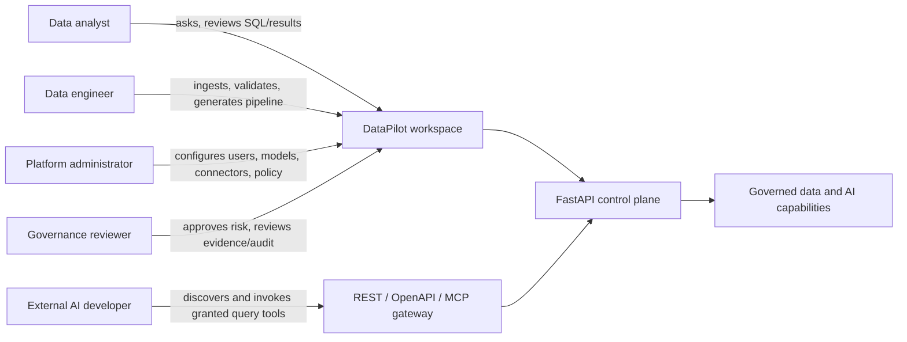
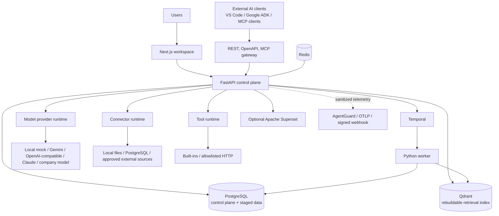
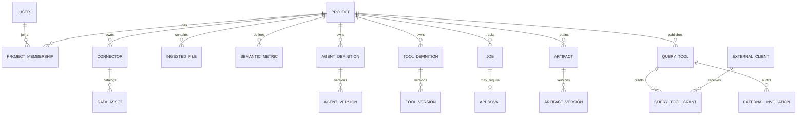
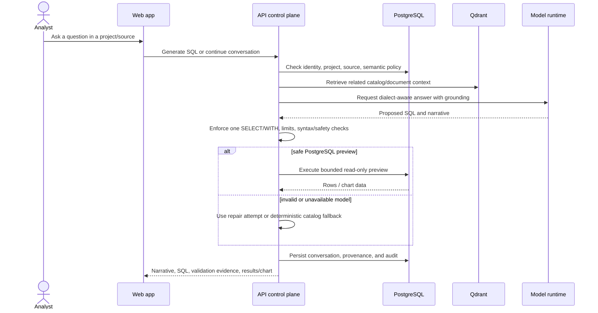
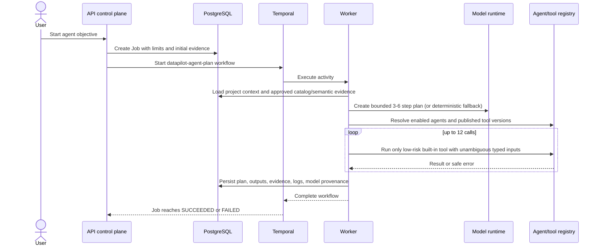
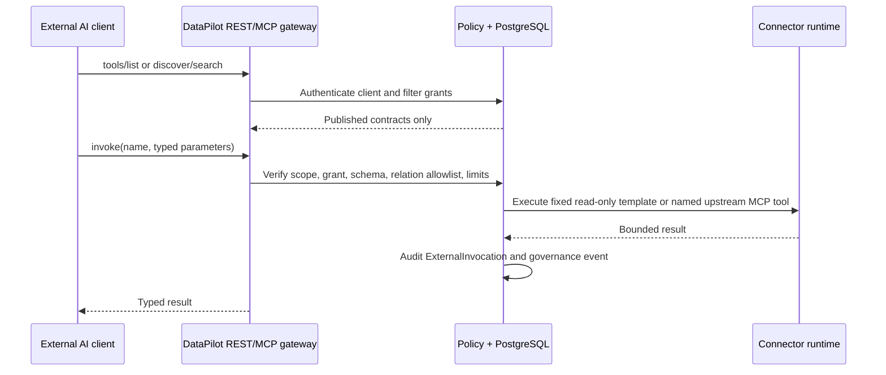
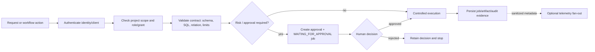

# DataPilot Agent OS: Product, Architecture, and Deployment Specification

**Status:** authoritative local-build reference  
**Last reviewed:** August 2, 2026  
**Audience:** product owners, data teams, platform engineers, security reviewers, and implementers

## 1. Executive summary

DataPilot Agent OS is a local-first, governed workspace for data analysts and data engineers. It brings data discovery, controlled file ingestion, catalog-grounded analysis, quality checks, generated pipelines, durable agent work, and secure data tools for other AI clients into one control plane.

The product solves a practical enterprise problem: teams need AI help across PostgreSQL, SQL Server, Oracle, Teradata, BigQuery, and local files, but cannot safely give a chatbot unrestricted database credentials or let an autonomous agent deploy changes without evidence. DataPilot makes models, tools, approvals, artifacts, and execution history governed resources rather than hidden implementation details.

The current repository is an executable local product. Its supported local path is: upload a structured file, profile and map it, stage it in PostgreSQL, discover it through catalog/vector search, ask a question, review a bounded read-only SQL preview, apply quality rules, generate a pipeline, approve a deployment or recurring schedule, and inspect durable evidence. Live certification of external databases and PingFederate requires organization-owned access and remains explicitly out of scope until it is supplied.

## 2. Problem, users, and value

### 2.1 Problems addressed

| Problem | DataPilot response | Result |
| --- | --- | --- |
| Analysts do not know the correct tables, metric definitions, or SQL dialect. | Catalog, semantic metrics, approved joins, hybrid search, and source-aware SQL generation ground the answer. | Faster and more defensible analysis. |
| Data engineers repeatedly build similar file-ingestion and transformation work. | File profiling, editable mapping, repeatable staging, quality rules, pipeline generation, lineage, and schedules make the path reusable. | Less manual setup and better operational consistency. |
| AI output can be unsafe or unauditable. | Read-only SQL validation, typed tools, risk levels, approvals, immutable versions, jobs, and audit events are enforced in the control plane. | AI assistance without uncontrolled production access. |
| External AI clients need data but must not receive database credentials or arbitrary SQL access. | Published fixed query tools are scoped to an external client and exposed through REST/OpenAPI and MCP. | Safe, discoverable reusable data capabilities. |
| Long-running work disappears in request threads or browser state. | Temporal workflows and product-facing jobs retain plan, status, evidence, outputs, logs, retries, and incidents. | Operable, replayable execution. |

### 2.2 Personas and their journeys



| Persona | Primary outcomes | Guardrail that protects the outcome |
| --- | --- | --- |
| Data analyst | Trusted answers, SQL preview, chart/narrative, saved reports. | SQL is catalog-grounded and one read-only statement only. |
| Data engineer | Profiled files, mappings, quality results, versioned pipeline packages, lineage, schedules. | Writes, deployments, recurring execution, and remediation can require approval. |
| Administrator | Project isolation, roles, model/connector configuration, published agent and tool definitions. | Secrets are held as environment or mounted-secret references, never sent to the browser. |
| Governance reviewer | Approval queue, versions, audit events, job evidence, retention controls. | An external telemetry vendor never becomes the authorization or approval system of record. |
| External AI developer | Typed, searchable, least-privilege query tools. | Callers cannot submit SQL, identifiers, connector credentials, or arbitrary endpoints. |

## 3. Scope and current delivery state

### 3.1 Original scope preserved

The original target is a provider-neutral, local-first AI data-engineering workspace: enterprise database and file context; analyst and engineering assistance; configurable models; a semantic layer; approvals and audit; bounded multi-agent operation; and external agent interoperability. It is not a replacement for a cloud data warehouse, an unrestricted coding agent, or a BI platform.

### 3.2 Delivered locally

| Capability | Current behavior |
| --- | --- |
| Identity and projects | Local password login, administrator-managed users and roles, project membership and project-scoped resources. |
| Models | Configurable local deterministic, OpenAI-compatible, Gemini, Claude, and company providers; selection, test, and model-call provenance. |
| Data context | Connector registry; metadata scan; data assets; keyword and Qdrant vector retrieval; semantic metrics and approved joins. |
| Files and data quality | CSV, JSON, Excel, and Parquet upload/profile/mapping/staging; versioned replace/append/key-merge; rules, runs, failures, quarantine, and controlled remediation. |
| Analysis | Persistent conversations; source/dialect-aware read-only SQL generation, validation, bounded PostgreSQL preview, repair fallback, results/charts, reports, and feedback. |
| Engineering | Pipeline generation, PostgreSQL view deployment after approval, basic dbt/Dataform package emission, quality checks, lineage, and approved schedules/watermarks. |
| Agent and tool registry | Versioned agent instructions and tools; published low-risk built-ins can run in bounded agent plans; allowlisted HTTP tools are typed, timed, retried, and audited. |
| Operations | Temporal-backed agent plans, scans, schedules, jobs, events, cancellation, retry, diagnosis, and incidents. |
| External access | Fixed read-only query tools, client credentials, per-tool grants, dynamic OpenAPI, and MCP `tools/list`/`tools/call`. |
| Collaboration and evidence | Versioned artifacts, diffs, comments, reviews, governed notebooks, evaluations, prompt versioning, audit events, and retention-policy approval. |
| Analytics | Optional embedded Apache Superset with DataPilot-brokered guest access and administrator editor handoff. |

### 3.3 Intentionally limited or not yet certified

| Boundary | Current safe posture | Completion evidence needed |
| --- | --- | --- |
| SQL Server, Oracle, Teradata, BigQuery | Read-only adapters and parameterized query contracts exist. | Credentialed probe, scan, query, timeout, recovery, and permission tests per system. |
| PingFederate | Configuration contract is present; local login remains active. | Tenant metadata, registered client, PKCE/callback/logout, role mapping, and negative-path validation. |
| Production rollout | Kubernetes baseline only; local Compose is the supported runtime. | Managed services, secret management, TLS/ingress, backup/restore, load/rollback, and disaster-recovery sign-off. |
| Autonomous operation | Bounded, registry-bound, low-risk built-in tool execution only. | Typed planner/executor budgets, simulation, policy tests, and approval-aware evaluation. |
| Collaboration | Versioned comments and reviews. | Real-time co-editing, conflict resolution, presence, and permission-aware audit model. |
| General lineage and deployments | Generated pipeline lineage and local PostgreSQL view deployment. | Parser-backed arbitrary SQL lineage and connector-specific deployment/recovery contracts. |

### 3.4 Non-goals

- Unrestricted database access, arbitrary SQL, arbitrary HTTP endpoints, or browser-submitted Python execution.
- Fully autonomous enterprise data modification.
- Snowflake or Databricks support in the present scope.
- Real-time multi-user notebook editing.
- Cloud deployment automation or a managed SaaS offering.
- Replacing Superset or another established BI tool.

## 4. Architecture

### 4.1 Context diagram



### 4.2 Component responsibilities

| Component | Purpose | Important boundary |
| --- | --- | --- |
| Next.js web application | A single workspace for data, analysis, quality, pipeline, job, approval, registry, and administration workflows. | Does not receive connector/provider secrets. |
| FastAPI control plane | Authentication, authorization, project scoping, policy, SQL safety, registry APIs, artifacts, approvals, audit, and orchestration requests. | PostgreSQL is its authoritative transactional store. |
| PostgreSQL | Users, projects, connector/catalog metadata, staged data, jobs, approvals, tools, query grants, lineage, quality, artifacts, conversations, evaluations, and audit. | Source of truth; Qdrant is derived. |
| Qdrant | Searchable catalog and document vectors for hybrid retrieval. | Rebuildable; no credentials are indexed. |
| Temporal and worker | Durable execution of agent plans, metadata scans, and scheduled ingestion outside the HTTP request lifecycle. | `Job` remains the product-facing record and links the workflow identity. |
| Model runtime | Selects a configured provider, performs model requests, records provenance/cost/latency, and uses deterministic fallback where appropriate. | Model output must still pass local validation and policy. |
| Connector runtime | Tests supported sources, scans metadata, and performs controlled read-only parameterized query work. | Stores secret references, never plaintext browser-visible credentials. |
| Tool runtime | Executes built-in handlers or allowlisted HTTP integrations using a declared JSON Schema, timeout, retry policy, and audit trail. | Arbitrary executable code and arbitrary outbound hosts are rejected. |
| External query gateway | Converts reviewed fixed query templates into discoverable REST/OpenAPI/MCP tools for granted clients. | Callers supply typed values only; SQL and identifiers remain server-owned. |
| Optional Superset | Embedded dashboards; DataPilot brokers project/dashboard-scoped guest access. | Superset is not the system of record for authorization. |
| Governance telemetry | Sends sanitized execution observations to configured destinations. | Telemetry is fail-open and complements, never replaces, local enforcement/evidence. |

### 4.3 Durable domain model



Key state objects are intentionally explicit: a **version** records what was approved or executed; a **job** records long-running work; an **approval** records the human decision; an **artifact** preserves generated output and review history; and an **audit event** records security-relevant actions.

## 5. Core workflows

### 5.1 File ingestion, quality, and pipeline delivery

```mermaid
sequenceDiagram
  actor E as Data engineer
  participant W as Web app
  participant A as API control plane
  participant P as PostgreSQL
  participant Q as Qdrant
  participant T as Temporal worker
  E->>W: Upload CSV/JSON/Excel/Parquet
  W->>A: Create ingestion and profile request
  A->>P: Store file metadata/profile/mapping
  E->>W: Review/edit mapping; choose load mode
  W->>A: Confirm mapping and stage
  A->>P: Create controlled relation and asset
  A->>Q: Index permitted metadata/text
  E->>W: Run quality rules / generate pipeline
  W->>A: Create quality run or pipeline artifact
  A->>P: Persist results, lineage, artifact version
  alt deployment or recurring schedule is risky
    A->>P: Create WAITING_FOR_APPROVAL job + approval
    E->>W: Approve
    W->>A: Record decision
    A->>T: Start durable workflow
    T->>P: Execute, advance watermark, retain evidence
  end
```

### 5.2 Grounded analytical question



### 5.3 Agent orchestration



### 5.4 External client query-tool invocation



## 6. Agents, orchestration, and tools

### 6.1 Specialist agent roles

The product treats an agent as a versioned instruction set with a model binding and a declared set of tools. A name alone grants nothing. A version must be published before the orchestration path considers it.

| Agent role | Purpose | Typical evidence/output | Execution authority |
| --- | --- | --- | --- |
| Planner | Decompose an objective into three to six bounded specialist steps. | Plan, limits, model provenance. | Draft only. |
| Metadata | Retrieve catalog assets, documents, metrics, and approved joins. | Grounding context with source identity. | Read-only retrieval. |
| SQL Analyst | Draft, explain, validate, and revise dialect-aware read-only SQL. | SQL, safety result, preview/evidence. | Bounded preview only when permitted. |
| Pipeline | Produce a local pipeline/view package and lineage draft. | Versioned package and generated lineage. | Deployment requires approval. |
| Quality | Profile data and propose or run governed checks. | Rule suggestions, pass rates, failure samples. | Remediation requires approval when configured. |
| Troubleshooter | Interpret job evidence and propose a safe retry/remediation. | Incident and recommended action. | Does not perform arbitrary remediation. |
| Policy | Check project scope, risk, and approval requirements. | Policy evidence. | Enforces limits; it is not a model-only opinion. |

### 6.2 Orchestration contract

- Temporal runs `datapilot-agent-plan`, `datapilot-metadata-scan`, and `datapilot-scheduled-ingestion` workflows. The worker polls due approved schedules every 15 seconds and uses a deterministic per-minute workflow ID to prevent duplicate dispatch.
- An agent plan retrieves bounded project context first. A configured non-local model may create a 3-6-step plan; the worker falls back to a deterministic plan when provider output is invalid or unavailable.
- Agents can use only enabled agents, published tool versions, declared tool names, low-risk built-in implementations, and parameters that can be supplied without guessing. The loop is capped at 12 tool calls.
- Higher-risk, approval-required, HTTP, or ambiguous tools are not autonomously run by this loop. The corresponding business action creates or waits on an approval path instead.
- Every run records durable plan, grounding, tool evidence, outputs, logs, job status, and model metadata. Cancellation, retry, diagnosis, and incidents remain connected to the job.

### 6.3 Internal tool registry

| Tool family | Examples | Benefit | Constraints |
| --- | --- | --- | --- |
| Built-in data/context | `catalog.search`, `dataset.profile`, `lineage.query` | Lets agents reason from controlled project evidence. | Project-scoped, typed parameters. |
| Built-in execution inspection | `sql.preview`, `job.inspect` | Supplies bounded query previews and operational evidence. | SQL preview remains read-only and limited. |
| Allowlisted HTTP | Published HTTP tools with a JSON Schema contract. | Integrates a known internal service without adding arbitrary code. | Host must be in `TOOL_HTTP_ALLOWLIST`; timeout/retries/risk/approval are declared. |

The runtime rejects undeclared parameters, wrong types, excessive sizes, arbitrary handlers, unsupported implementation types, and hosts outside the allowlist. Tool executions are recorded with attempt count, duration, identity context, and success/failure outcome.

### 6.4 External query-tool gateway

This is a separate registry from internal tools. A query tool has a fixed administrator-authored SQL template, typed value parameters, approved connector, relation allowlist, row limit, timeout, publication state, client grants, and audit history. It can use native read-only connector drivers or a named tool on an upstream HTTP MCP server.

External clients can discover only tools granted to their project-scoped credential. They use REST discovery/invocation, a generated OpenAPI contract, or the DataPilot MCP endpoint. They never receive database credentials and never pass SQL or identifiers.

## 7. Security, governance, and data handling

### 7.1 Enforcement model



### 7.2 Required controls

- **Identity and tenant boundary:** local authentication, roles, project membership, project-scoped queries, and distinct external client credentials/grants.
- **Secrets:** connector and provider configuration use `env:VARIABLE_NAME` or mounted secret references. Credentials are not stored in the UI or source control.
- **SQL safety:** a single `SELECT` or `WITH` statement only; DDL, DML, multiple statements, malformed content, and unsafe output are rejected. Preview limits apply.
- **Tool safety:** JSON Schema validation, built-in or allowlisted HTTP implementations only, timeout/retry, risk levels, and audit evidence.
- **Approval boundary:** writes, DDL, deployment, recurring schedules, retention cleanup, high-risk tool execution, and destructive remediation route through approval as configured.
- **Evidence:** model provenance, job logs/outputs, versions, comments/reviews, lineage, tool invocations, approval decisions, and audit events are durable.
- **Telemetry privacy:** AgentGuard, OTLP, and signed webhook destinations receive sanitized metadata. Local authorization and approval enforcement do not depend on telemetry availability.
- **Notebook safety:** governed notebooks support markdown, read-only SQL, and a restricted Python expression environment; imports, file/network access, and arbitrary functions are prohibited.

## 8. Deployment and operations

### 8.1 Local deployment (supported baseline)

Prerequisites: Docker Desktop with Compose and available ports `3001`, `8000`, `5433`, `6333`, `6380`, `7233`, and `8233`; `8088` is additionally needed for Superset.

```powershell
Copy-Item .env.example .env
docker compose up --build
# Optional embedded analytics
docker compose --profile analytics up --build
```

| Endpoint | Purpose |
| --- | --- |
| `http://localhost:3001` | DataPilot workspace |
| `http://localhost:8000/docs` | FastAPI OpenAPI documentation |
| `http://localhost:8000/health/live` | Process liveness |
| `http://localhost:8000/health/ready` | API plus metadata-database readiness |
| `http://localhost:8233` | Temporal UI |
| `http://localhost:6333/dashboard` | Qdrant dashboard |
| `http://localhost:8088` | Superset when the analytics profile is enabled |

The seeded administrator (`admin@datapilot.local` / `ChangeMe123!`) is a local bootstrap default and must be changed before sharing an environment.

### 8.2 Service topology

| Service | Runtime purpose | Stateful dependency |
| --- | --- | --- |
| `web` | Next.js UI, exposed on 3001. | Depends on API readiness. |
| `api` | FastAPI control plane, exposed on 8000. | PostgreSQL, Redis, Qdrant; shared upload volume. |
| `worker` | Temporal activities and schedule dispatcher. | PostgreSQL, Temporal, Qdrant; shared upload volume. |
| `postgres` | Metadata, control-plane state, staged data. | Persistent Compose volume. |
| `redis` | Local coordination/cache foundation. | Persistent Compose volume. |
| `qdrant` | Derived vector retrieval index. | Persistent Compose volume; rebuildable. |
| `temporal` | Durable workflow service and UI. | Local development server. |
| `superset` / `superset-bootstrap` | Optional embedded BI and idempotent demo bootstrap. | Analytics Compose profile only. |

### 8.3 Direct developer run

The API uses SQLite when `DATABASE_URL` is absent, which permits a self-contained direct development path. For the full product workflow, use Compose because it supplies PostgreSQL, Qdrant, Temporal, and shared volumes.

```powershell
python -m venv .venv
.\.venv\Scripts\Activate.ps1
pip install -r apps\api\requirements.txt
uvicorn apps.api.app.main:app --reload --port 8000

cd apps\web
npm install
npm run dev
```

### 8.4 Production baseline and release gates

`infra/kubernetes` supplies Kustomize manifests for the API, worker, and web services. It deliberately assumes managed PostgreSQL, Redis, Qdrant, Temporal, an OTLP collector, organization-specific secrets, TLS/ingress, and backup controls.

Before any production cutover, complete the following release gates:

1. Store runtime secrets in the organization secret manager; do not use local default values.
2. Configure managed backing services, network egress rules, TLS ingress, and least-privilege runtime identities.
3. Validate liveness (`/health/live`) and readiness (`/health/ready`) probes, worker reconnect/retry behavior, and telemetry redaction.
4. Run connector-specific credential, permissions, timeout, recovery, and schema-drift tests for every enabled source.
5. Test backup/restore, secret rotation, a worker failure/retry drill, load/rollback, and disaster recovery.
6. Approve retention, audit export, telemetry privacy, and model-provider data handling with security and governance owners.

## 9. Verification and operating use cases

### 9.1 Current verification baseline

The documented August 2026 local verification baseline is: API acceptance suite (54 passing tests), web production build, Docker API readiness, browser preflight for the local development origin, and AgentGuard initialization/custom event emission. This is evidence for the local path, not production certification of external systems.

### 9.2 Recommended demonstrations

1. **Analyst question:** ingest a CSV, ask a catalog-grounded question, inspect generated SQL/safety evidence, and run the bounded preview.
2. **Data quality and pipeline:** map/stage a file, propose/run quality rules, generate a pipeline, review lineage, request/approve deployment, and inspect the view.
3. **Recurring ingestion:** create an append or merge schedule with a watermark, approve it, run it now, and inspect the Temporal-backed job.
4. **Agent operation:** start a bounded agent objective, inspect the plan, grounding, tool traces, job outputs, and model provenance.
5. **External agent access:** create/test/publish a fixed query tool, issue a client credential/grant, then invoke it using REST or MCP.
6. **Governance review:** version an artifact/prompt, add a review decision, approve a risk-gated action, and inspect the linked audit evidence.

## 10. Documentation ownership

This file replaces the previous overlapping product specification, local build plan, architecture reference, implementation status, requirement traceability matrix, audit, enterprise gap register, and demo runbook. Keep it current whenever scope, architecture, deployment, or certification status changes.

The retained supporting documents are:

| Document | Use it for |
| --- | --- |
| [README.md](../README.md) | Fast local startup and repository orientation. |
| [DATA_CONNECTIONS_LINEAGE_AND_TOOLS_GUIDE.md](DATA_CONNECTIONS_LINEAGE_AND_TOOLS_GUIDE.md) | Plain-language explanation of source connections, PostgreSQL staging, SQL generation/execution boundaries, semantic definitions, MCP tools, pipelines, and lineage. |
| [ENTERPRISE_READINESS_AND_AGENT_CAPABILITY_ASSESSMENT.md](ENTERPRISE_READINESS_AND_AGENT_CAPABILITY_ASSESSMENT.md) | Implementation-grounded assessment of enterprise readiness, persisted memory, self-learning boundaries, agent harnessing, registry adoption, and usability roadmap. |
| [DATABASE_MCP_TOOL_REGISTRY_GUIDE.md](DATABASE_MCP_TOOL_REGISTRY_GUIDE.md) | Exact database query-tool, upstream MCP, VS Code, and Google ADK configuration examples. |
| [AgentGuard_Governance_Integration_Guide.docx](AgentGuard_Governance_Integration_Guide.docx) | Detailed vendor-neutral governance telemetry and AgentGuard operating guidance. |
| [infra/kubernetes/README.md](../infra/kubernetes/README.md) | Kubernetes manifest prerequisites and apply commands. |
